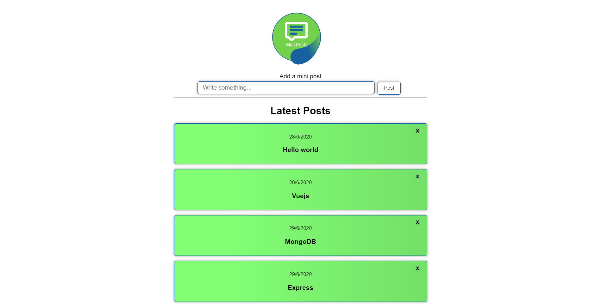

## mini-posts

### Demo
* [mini-posts](https://mini-posts.herokuapp.com/)

## Tools
* [Vue](https://vuejs.org/), [Express](https://expressjs.com/),  [MongoDB](https://www.mongodb.com/), [Heroku](http://heroku.com/)

## Details
* The application is hosted on Heroku, connected to MongoDB where the posts are being saved.
* Anyone can write and remove notes from the app

## Images

